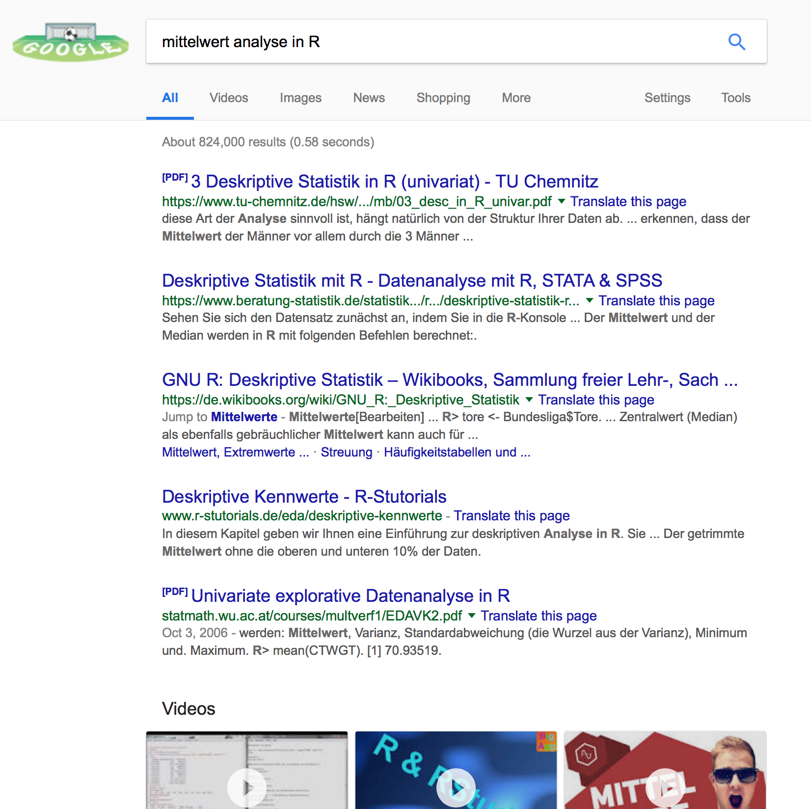

# Einleitung {#einleitung}

Todo :)

## Übersicht nach Lehrveranstaltung:
Empirische Forschungsmethoden für Fortgeschrittene siehe Kapitel \@ref(EmpirischeMethoden)


```{r include=FALSE}
# automatically create a bib database for R packages
knitr::write_bib(c(
  .packages(), 'bookdown', 'knitr', 'rmarkdown'
), 'packages.bib')
```


## Warum R?

Es gibt viele Gründe sich für oder gegen eine statistische Umgebung zu entscheiden. Neben der individuellen Erfahrung und vorhandenen Expertise, die im beruflichen Einsatz sicherlich am stärksten zählen, gehören weitere Aspekte in der akademischen Ausbildung zu den wichtigeren Aspekten.

Eine grundlegende Entscheidung muss zunächst getroffen werden. Soll die Umgebung eine GUI-basierte^[engl. Graphical User Interface - eine graphische Benutzerumgebung] Umgebung sein oder eine programmatische?
Der Vorteil eine GUI-basierten Umgebung liegt in der Geschwindigkeit der Anwednung und der flachen Lernkurve. Befehle können im Menü gesucht werden und müssen nicht auswendig gelernt werden. Komplizierte Analysen sind bereits mit 2-3 Klicks durchgeführt. Die meisten GUI-basierten Umgebungen sind allerdings *kostenpflichtig*. Ein weiterer Nachteil von GUI-basierten Umgebungen ist die fehlende *Replizierbarkeit*. Möchte man die Analyse eines Kollegen erneut durchführen, müssen exakt die selben Mausbewegungen und -klicks nachgespielt werden. Lösungen wie SPSS bieten für solche Fälle eine Syntax mit der eine programmatische Auswertung durchgeführt werden kann.

Die Programmiersprache R hat verschiedene Vorteile gegenüber GUI-basierten Umgebungen. R ist: 

- Kostenfrei
- Cross-Plattform kompatibel
- Wiederholung eingebaut
- Reproduzierbarkeit
- Druckreife Visualisierung, Gute Integration in Publishing Prozesse

Allerding erfordert der Einstieg in R einen höheren Lernaufwand und jede Analyse erfordert das Schreiben eines Programms. Dafür bietet R durch den Open-Source Ansatz eine Fülle von weiteren Paketen mit denen man auch andere Aufgaben im Forschungsprozess bearbeiten kann. So wurde dieses Buch z.B. mit dem Paket `bookdown` geschrieben und veröffentlicht.


### Unterschied GUI und statistische Programmiersprache
Beispiele:

- GUI Datenanalyse-Tools: **SPSS**, STATA, RapidMiner, etc.
- Programmiersprachen für die Datenanalyse: Python, Julia, **R**, etc.


## Verwandte Literatur

Es git eine Vielzahl von weiterführender Literatur, die sich mit der Programmiersprache R für die Datenanalyse auseinander setzt. Als Einstieg sind folgende offene online Bücher zu empfehlen.

  - R for Data Science, Link: http://r4ds.had.co.nz
  - R for Social Science, Link: http://socviz.co/ 
  - Modern Dive: https://moderndive.com/index.html
  

Neben Büchern gibt es ein Fülle von Resourcen, die die unterschiedlichste Themen im Umgang mit der Programmiersprache R thematisieren. Hierzu zählen quell-offene Lehrveranstaltungen an anderen Universitäten, Blogs, Foren und auch sog. Cheat-Sheets. Letztere enthalten Kurzübersichten zu einzelnen Themen, die auf einer Seite zusammengefasst sind. Beim Erlernen eines neuen Themas, können diese ausgedruckt und als Lernhilfe neben den Computer gelegt werden.

- http://compcogscisydney.org/learning-statistics-with-r/ 
- http://compcogscisydney.org/psyr/ 
- http://www.sthda.com/english/
- https://www.statmethods.net/index.html
- https://www.r-bloggers.com/
- Cheat-Sheets: https://www.rstudio.com/resources/cheatsheets/

Um wirklich einen umfangreichen Überblick über aktuelle Entwicklungen zu bekommen, hilft es bei Twitter gewissen Hashtags oder bestimmten Usern folgen^[Diese Hashtags und User spiegeln den Stand vom 16.10.2018 wieder.].

Hashtags mit Bezug zu R:
- \#rlang, #rstats, #r4ds, #rladies

User, die aktiv R vorantreiben: 
- RLangTip, RBloggers, rOpenSci, RLadiesGlobal, hadleywickham, juliasilge


### Was tun wenn etwas nicht funktioniert?

Fast jede Frage, die man zu R hat, hat auch ein Suchergebnis bei Google. So zeigen sich zum Beispiel auf die Frage nach eine Mittelwertanalyse in R über 800.000 Suchergebnisse in Google (siehe Abbildung \@ref(fig:googlefig))!


```{r googlefig, echo = FALSE, fig.cap="Suchergebnisse von Google am 16.10.2018"}

```


